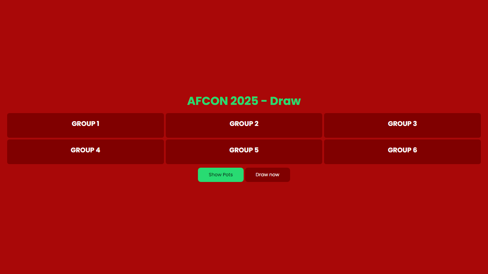
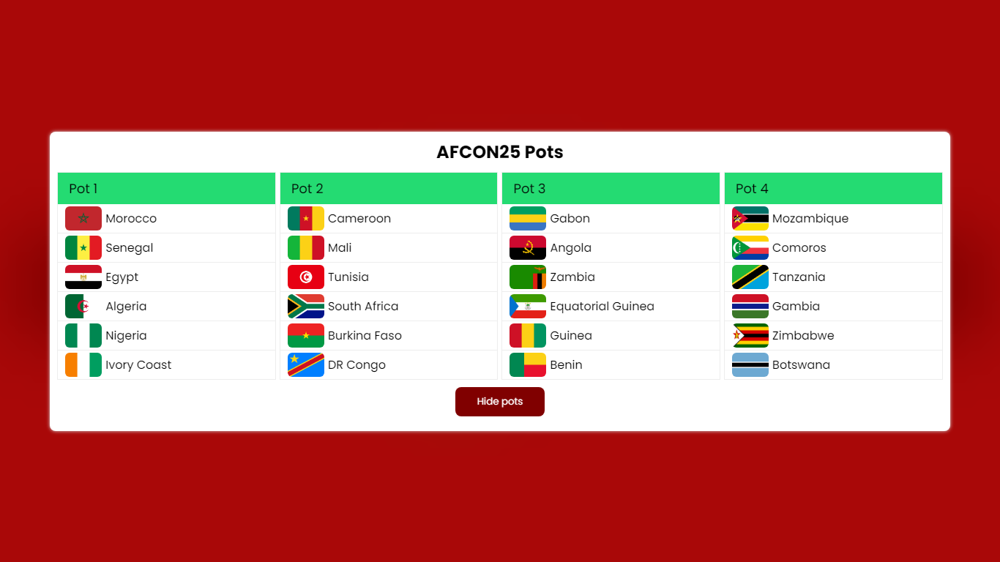

# Football Group stage Draw 




This a simple Group stage football competiton Random draw Application Using HTML , CSS & JS
## installation
1 - clone or download this repo
```bach 
git clone 'https://github.com/Ourouimed/group-stage-draw.git'
```
2 - on main.js file Edit teams if you want betweens "" on each pot in `Pots` Object (line : 13) ex :
```bach 
let Pots = {
    Pot1: [
        { name: "Morocco", flag: "assets/flags/ma.webp" },
        { name: "Senegal", flag: "assets/flags/sn.webp" },
        { name: "Egypt", flag: "assets/flags/eg.webp" },
        { name: "Algeria", flag: "assets/flags/dz.webp" },
    ...]

```}
3 - Open index.html file

## usage 
- Create a random group stage draw
- each group will had 4 team 1 team from each pot
- teams in the same pot can't be in the same group 

## What's new 20/01/2025 ?
- Changing Website UI (AFCON 2025 theme)
- Add Each team flag and name 
- The draw process automaticly put Morocco in first group (Host country)

## demo 
For Live preview [click here](https://ourouimed.github.io/group-stage-draw)